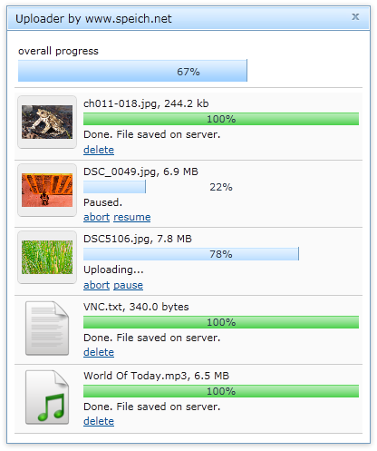

Upload multiple files at once with drag and drop. For each file a thumbnail is created automatically. Every upload can be paused, resumed and cancelled individually.
Works with Firefox 3.6 and Google Chrome 7 or greater.

#Dependencies
The file uploader has the following dependencies:
* [The Dojo Toolkit](http://dojotoolkit.org) version 1.10.4
* [PHP](http://php.net) version 5.3 or greater (for upload handling on the server)
* [DialogConfirm] (https://github.com/speich/DialogConfirm) to display a customized dijit to display dialogs 
It is recommended to arrange all dependencies as siblings, resulting in a directory structure like the following:

* `dojo`
* `dialogConfirm`
* `fileUploader`

More information can be found reading <a href="http://www.speich.net/articles/2011/03/03/dojo-demo-multiple-file-uploading-with-pauseresume/">
	Multiple file uploading with pause/resume</a> on speich.net and
	<a href="http://hacks.mozilla.org/2011/04/resumeupload/">How to resume a paused or broken file upload</a> on hacks.mozilla.org.
You can also check out the drag and drop demo at <a href="http://www.speich.net/articles/html5-uploader.php">HTML5 demo: Multiple file upload with drag and drop</a>.

If you have any questions, please post them on my website at <a href="http://www.speich.net/articles/2011/03/03/dojo-demo-multiple-file-uploading-with-pauseresume/">Multiple file uploading with pause/resume</a>.

+ Resume is only supported on Firefox 4 or greater.
+ The uploader is in demo mode, which does not save anything to the server. Set demo mode to false on your own risk and only if you now what you are doing!